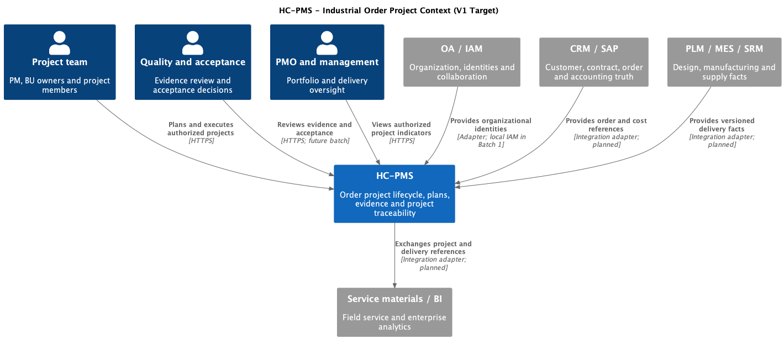

# HC-PMS 系统上下文

状态: V1 设计基线, 2026-09-22. 实现边界见 [开发路线](10-development-roadmap.md).

[PlantUML 源文件](../../doc/diagrams/context/hc-pms.puml)

HC-PMS 管理订单项目从合同交接到验收关闭的过程. CRM/SAP 保持客户与合同订单事实的所有权, PMS 管理项目结构及项目过程记录. PMS 不替代财务账簿, PLM 版本库, MES 制造执行或专业测试系统.

| 参与者 | 工作与可见范围 |
|---|---|
| PMO / 管理层 | 经授权汇总项目组合, 监控进度与交付风险 |
| 项目经理 | 负责项目立项, 团队, 计划和变更协调 |
| BU / 专业负责人 | 维护授权子项目与单机任务, 提交交付物 |
| 质量 / 客户验收代表 | 审核证据, 给出 Gate 和 FAT/SAT 结论 |
| 财务人员 | 查看经营口径, 核对概算/预算/核算/决算 |
| 系统管理员 | 身份, 菜单权限和运维配置 |

第一批继承模板管理员角色, 新增项目 manager/editor/viewer 成员关系. 精细的 BU 节点授权, 质量角色职责分离及财务字段权限在对应批次交付前实现, 不能仅靠页面隐藏保护.

## 外部系统与事实所有权

| 系统 | 主数据 / 权威记录 | PMS 接收 | PMS 输出 | 首次交付 |
|---|---|---|---|---|
| CRM | 客户, 商机, 商务承诺及现场执行反馈 | 客户和合同上下文, 现场进展 | 项目交付状态 | 适配器批次 |
| OA / IAM | 组织, 用户, 审批身份 | 人员及部门, 审批回执 | 待办, 审批申请 | 首批用模板本地身份 |
| PLM | 设计/BOM/技术文件版本 | 发布版本及变更引用 | 需求与项目关联 | 适配器批次 |
| SAP | 订单, 会计凭证和实际成本 | 订单, 费用, 到货/发运事实 | 项目编码, 预算/计划引用 | 适配器批次 |
| MES | 生产工单和执行事实 | 装配/调试状态 | 项目和单机计划引用 | 适配器批次 |
| SRM | 采购协作和供应承诺 | 交期, 催交和供应异常 | 项目需求日期 | 适配器批次 |
| 销服物料系统 | 发运物料及装箱记录 | 装箱/装车/缺件清单 | 项目及单机引用 | 适配器批次 |
| BI | 跨域分析模型 | 经确认的变更损失/分析结果, 目标及口径配置 | 授权指标快照 | 经营批次 |

专业 LIMS/测试系统是可选扩展, 用于将测试记录关联到 URS 与 Gate, 不是原有八系统集成的已完成项. 供应商 API, 字段, 认证和网络可达性须在适配器开发时取得, 本设计不虚构接口地址.

## 系统边界与假设

- V1 为单组织部署, 项目为数据访问边界. `dept_id` 只表示归属, 不能被当作完整租户隔离.
- 主项目对应合同交付总责任, 子项目对应 BU 交付责任; 单机为交付/计划对象, 不另立第三种组织项目级别.
- 资料原件仍由授权文件系统管理. 数据库保存稳定引用, 版本, 哈希和批准状态.
- 项目状态, 计划完成率, Gate 结论是三个独立概念. 不允许用状态切换代替质量审批.
- AI 读取经过权限过滤的数据, 输出带证据的建议. 人工确认后才产生正式业务命令.
