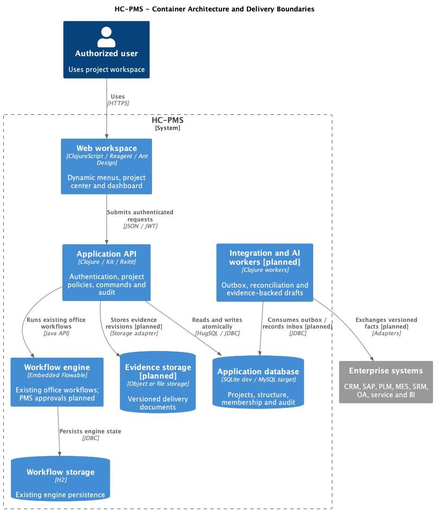

# HC-PMS 容器与实现架构



[PlantUML 源文件](../../doc/diagrams/container/hc-pms.puml)

## ADR-001: 延续真实模板

基线为 `RedCreationTech/ruoyi_clojure`, `ruoyi-template`, commit `99706b06fea4ff9efed6822a70cbda1c2bd98552`. 本仓库保留其历史与命名空间, 上游配置为 `upstream`, 产品仓库配置为 `origin`.

采用模块化单体, 在已有 Kit 应用增加 `pms` 领域, 保留身份/组织/动态菜单/监控/BPM. 前端为 ClojureScript + Reagent 2 + re-frame + Ant Design 6. 先前讨论中的 Vue3/Vben 不是该模板的实际技术栈, 不在首批更换. 参考产品只用于需求比较, 不引入整套 Spring Cloud 基础设施.

## ADR-002: 数据库与事务

SQLite 为本地开发默认, MySQL 8 为首批生产目标. 迁移必须在两个目录成对维护, 使用 Migratus `--;;` 分隔每条语句. PostgreSQL 虽有模板驱动依赖, 没有完整 PMS 迁移与验证前不宣称支持.

业务命令在单个 JDBC 事务中修改聚合和追加审计事件. 更新以 `version` 做乐观锁, 零行更新返回 409. 多表权限与状态校验与写入应使用同一个事务连接. 列表, 详情和聚合统计使用同一项目可见性条件, 不在客户端过滤越权数据.

## ADR-003: 保留流程引擎, 分离业务事实

模板已有嵌入式 Flowable, 使用独立 H2 存储. 首批项目状态流转使用显式领域规则, 不声称已经接入立项审批. 后续 Gate/变更审批需要 `approval_request` 与 outbox/inbox, 将业务事务和引擎调用分离. 不将两个库的普通写入误当成跨库原子事务.

建议审批时序: 冻结证据快照 -> 保存申请与 outbox -> worker 幂等启动流程 -> 保存实例关联 -> 接收回调并写 inbox -> 校验审批人与快照版本 -> 原子更新业务结果与审计. 故障留在待重试或人工处理状态, 不静默放行.

## 运行组件

| 组件 | 责任 | 当前状态 |
|---|---|---|
| Web | 登录, 动态权限菜单, 项目中心, 项目驾驶舱 | 首批实现 |
| HTTP API | JWT, 功能权限, DTO/错误转换, PMS 路由 | 首批实现 |
| PMS 领域服务 | 项目规则, 数据范围, 结构, 成员, 状态和审计 | 首批实现 |
| HugSQL / JDBC | 参数绑定, 持久化和事务 | 首批实现 |
| 应用数据库 | 项目, 节点, 成员和变更事件 | 首批实现 |
| Flowable / H2 | 模板既有办公流程 | 保留, PMS 审批未接线 |
| 集成 worker | outbox/inbox, 同步游标, 重试和对账 | 后续设计 |
| 证据文件存储 | 受控上传, 版本, 哈希, 扫描和签发 | 后续设计 |
| AI worker | 授权快照, 检索, 建议与草稿 | 后续设计 |

## 代码边界

```text
src/cljs/com/ruoyi/frontend/pages/pms/   页面与交互
src/cljs/com/ruoyi/frontend/api.cljs     统一认证请求
src/clj/com/ruoyi/web/routes/pms.clj     路由
src/clj/com/ruoyi/web/controllers/pms.clj HTTP 边界
src/clj/com/ruoyi/domain/pms/            领域与数据访问规则
resources/sql/pms*.sql                  HugSQL 查询
resources/migrations-sqlite/            开发数据库迁移
resources/migrations/                   MySQL 迁移
test/clj/com/ruoyi/pms_test.clj          领域及数据库验证
tests/e2e/pms.spec.js                    浏览器流程验证
```

## 运行与非功能验收

- 首批使用模板 JWT 与现有用户. 部署前更换模板默认账号口令, 设置 `JWT_SECRET` 与 `COOKIE_SECRET`.
- HTTP 对外经 TLS 代理, nREPL 仅本机开发绑定. 生产关闭开发入口并使用已构建静态资源.
- 数据权限在后端强制执行; 管理权限与项目成员授权是交集. 组织隔离与多租户为后续架构扩展.
- 审计事件记录操作者, 聚合版本, 动作和时间; 未来增加保留策略和外部只追加归档. 当前数据库管理员仍可改表, 不宣称防篡改认证.
- 目标验收环境: 10,000 项目, 每项目 2,000 节点. 列表 p95 < 500ms, 详情 p95 < 800ms 为待压测目标, 不是当前测量值.
- 备份应用库与流程库, 恢复后对账审批实例. RPO 24h / RTO 4h 为初始运维目标, 上线前通过恢复演练确认.
- 后续大量任务与证据采用分页和按需加载; 首批树/成员/事件全量查询仅适合试运行规模, 扩量前增加游标分页与规模约束.
